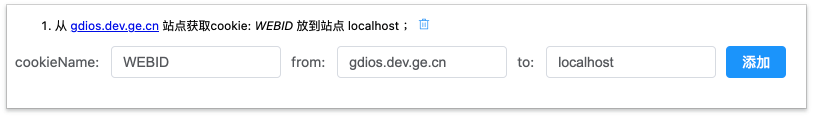

# `chrome-extension-cookie`一键搞定 cookie 跨域访问

开发环境下用来自动获取 cookie 的 chrome 插件。
输入源站点和目标站点以及 cookieName,便可以自动获取和监听 cookie 的变化并实时更新。

> A chrome plug-in used to automatically obtain cookies in the development environment. By entering the source site, target site and cookie name, you can automatically obtain and monitor the changes of cookies and update them in real time.

## 使用方法

1. clone 本仓库

```js
git clone https://github.com/aMiing/chrome-extension-cookie.git

cd chrome-extension-cookie
npm install
npm run build

```

2. 打包
3. 打开 chrome 扩展程序设置
4. 右上角打开开发模式
5. 加载已解压扩展程序,选择`dist`文件夹（如果是 crx 压缩文件，直接将文件拖入该设置界面）
6. 浏览器右上角点击扩展程序图标，在弹出窗口中填入您需要设置的信息
    > cookieName: cookie 名称； from: 源站点； to: 目标站点；

## 实现原理

`chrome-extension`可以声明权限并在扩展中使用相关权限的 api。 [查看中文文档](http://www.kkh86.com/it/chrome-extension-doc/extensions/cookies.html)
具体实现细节如下：

### 声明`permissions`

在全局配置文件中声明要使用的权限

```js
// mainifest.json
"permissions": ["storage",  "*://*/", "cookies"],
```

### 浏览器行为

1. 配置浏览器行为
   `default_popup`是浏览器中点击该扩展图标需要展示的弹出页面。

```js
// mainifest.json
"browser_action": {
    "default_icon": "sources/icon128.png",
    "default_title": "解决Chrome浏览器Cookie跨域携带问题",
    "default_popup": "index.html"
},
```

我们要在弹出页面里面输入相关的配置项，所以此处配置是必要的。 2. 弹出页面
我们可以在弹出页面中配置 `cookieName: cookie 名称； from: 源站点； to: 目标站点；`

其核心逻辑就是添加和删除时候，触发修改 localstorage。

```js
localStorage.setItem("domainList", JSON.stringify(domainList));
```

### 背景页

1. 配置背景页
   背景页中可以使用在清单文件里面声明的权限

```js
// mainifest.json
"background": {
        "scripts": ["background.js"],
        "persistent": true
    },
```

2. 背景页

-   首先是监听`localStorage`的变化,触发对 cookie 的修改逻辑

```js
window.addEventListener("storage", ({ key, newValue, oldValue }) => {
    if (key === "domainList") {
        // 比较变化的数据，判断是增添或者删除
        newValue = JSON.parse(newValue) || [];
        oldValue = JSON.parse(oldValue) || [];
        storageList = newValue;
        if (newValue.length > oldValue.length) {
            // 新增，最后一条为新增，仅取最后一条
            init(newValue.slice(-1));
        } else {
            // 移除cookie
            const deleteValue = oldValue.find(e => !newValue.some(n => n === e));
            console.log("deleteValue", deleteValue);
            chrome.cookies.remove({
                url: "https://" + deleteValue.to,
                name: deleteValue.name,
            });
        }
    }
});
```

-   当配置了监听的 cookie 发生变化后，相对应的`to`domain 的 cookie 也要跟随变化
-   上面一步我们保存了变化后的`storageList`

```js
// 获取了所有cookie的变化
chrome.cookies.onChanged.addListener(function (changeInfo) {
    const fromList = storageList.map(e => e.from);
    // 过滤出设置了监听的cookie
    if (fromList.includes(changeInfo.cookie.domain)) {
        const target = storageList.find(e => e.from === changeInfo.cookie.domain);
        // 移除
        if (changeInfo.removed) {
            chrome.cookies.remove({
                url: "https://" + target.to,
                name: changeInfo.cookie["name"],
            });
        }
        // 设置或更新
        else {
            chrome.cookies.set({
                url: "https://" + target.to,
                name: changeInfo.cookie["name"],
                path: "/",
                value: changeInfo.cookie["value"],
                expirationDate: changeInfo.cookie["expirationDate"],
                secure: true,
                sameSite: "no_restriction", // 不阻止跨域cookie
            });
        }
    }
});
```

## 总结
chrome扩展的存在能够突破浏览器的安全限制，获取到很多js脚本中无法拿到的权限。更加灵活高效。
日常开发中遇到难以实现的需求，不妨试试`chrome-extension`大法。

> 没有什么自行车是造不出来的，大不了把流水线拆了重装。
